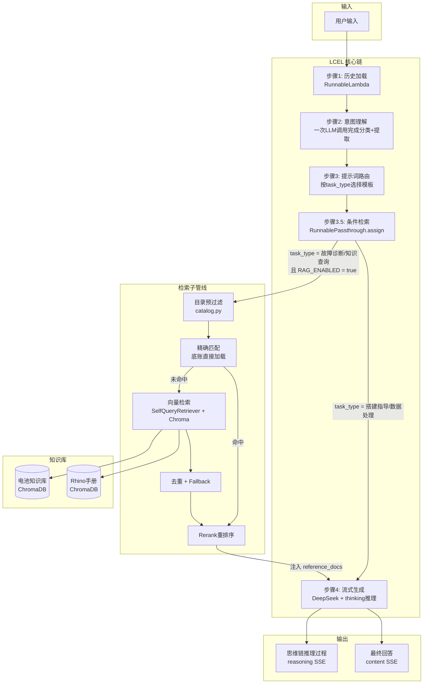
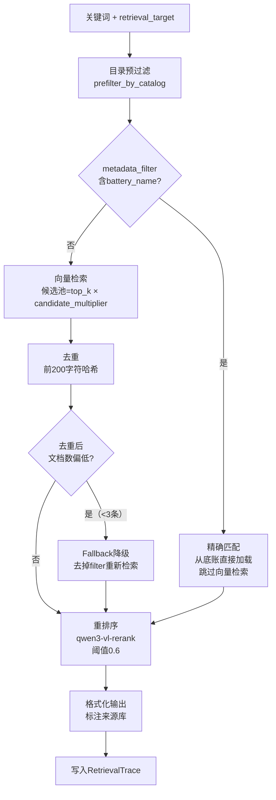

# Grasshopper AI助手demo_产品说明

## 1. 项目概览

### 1.1 技术栈

| 层级 | 技术选型 | 选型理由 |
|------|----------|----------|
| **链编排** | LangChain 1.0.4 LCEL | 声明式管道，流式传递、条件触发、会话注入 |
| **数据验证** | Pydantic 2.11 | 将LLM输出的JSON转为类型安全的Python对象，做最终验收 |
| **配置管理** | PyYAML + python-dotenv | 三优先级加载（.env > app.yaml > 代码默认值） |
| **后端** | FastAPI + SSE | 7个端点，流式聊天，会话CRUD |
| **前端** | React 18 + TypeScript + Vite + TailwindCSS | 完整前端框架，Markdown渲染，流式输出 |

> **关于Pydantic的角色**：Pydantic在本项目中作为后端数据验证与序列化引擎。LLM输出格式的约束分两层：① 启用 DeepSeek JSON Output 模式（`response_format={'type': 'json_object'}`）保证输出合法 JSON；② `prompts.yaml` 中的文字说明 + JSON 格式样例约束字段结构。`parse_json_with_fallback()` 负责解析层（含正则清洗兜底），Pydantic 在解析成功后做类型验收。DeepSeek V4 Pro 支持 `json_object` 模式但不支持 `json_schema` 模式（Structured Outputs）——即模型能保证输出合法 JSON，但不保证字段完全符合 Pydantic Schema。因此保留 `parse_json_with_fallback` 作为兜底，应对官方已知的"有概率返回空 content"问题，并通过 `_invoke_llm_with_retry` 对空 content 自动重试。

### 1.2 模型选型

#### 主分析模型：DeepSeek V4 Pro

DeepSeek V4 Pro 在 DeepSeek 体系内定位为**推理增强模型**，主打深度推理能力：

| 特性 | 与项目场景的匹配 |
|------|-----------------|
| **长思维链（CoT）** | 适合"电池链搭建指导"——模型需要在内部推理：给什么电池、怎么连、注意什么数据流 |
| **结构化输出** | 要求输出严格的 Markdown 表格（电池连接图解、步骤表），V4 Pro 的格式遵循能力很强 |
| **中文场景优化** | 参数化BIM建模工程师用户群以中文为主，中文术语理解（如"烘焙""数据结构""Graft/Flatten"）需要精准 |

项目已深度集成 DeepSeek 客户端（`src/core/client.py`），`enable_reasoning=True` 可直接开启推理模式，无需额外适配。

**选型结论**：中文推理能力 + 高性价比 + 代码即用。

#### 向量模型：DashScope text-embedding-v4

| 能力 | 与项目场景的匹配 |
|------|-----------------|
| **中英混合处理** | 电池名称中英混杂（"Point"、"布尔差集"），需要能同时理解中英文语义 |
| **短文本优化** | 电池文档 text 通常 200-800 字符，v4 对短文本的语义压缩效率较高 |
| **1024 维** | 维度适中，检索速度与精度平衡 |

与 Rerank 模型配套使用，形成完整的「粗召回 → 精排」链路，两者由同一供应商（DashScope）提供，API 风格一致、调用方式统一、环境变量复用（`DASHSCOPE_API_KEY`）。

**选型结论**：中英混合语义理解 + DashScope 生态无缝集成 + 代码即用。

#### 重排序模型：DashScope qwen3-vl-rerank

Rerank 与普通 Embedding 不同，输入是 `(query, 候选文档)`，输出是相关性分数，对模型的**跨文档对比推理能力**要求更高：

| 特性 | 优势 |
|------|------|
| **意图匹配精度** | 能区分"Point 电池怎么用"和"Point 是什么"的细微差别 |
| **短文档处理** | 电池文档短（200-800 字），Rerank 能在细粒度上判断相关性 |
| **中文 Query 理解** | 幕墙术语（"烘焙""数据结构""Graft"）的本土化理解优于国际模型 |

与 Embedding 模型协作：text-embedding-v4 粗召回 → qwen3-vl-rerank 精排（阈值 0.6，输出 Top-5）。

**选型结论**：多语言语义匹配精度 + 与 Embedding 模型协作形成完整链路 + 计算成本可控。

#### 三模型整体评估

| 模型 | 项目中的角色 | 关键优势 |
|------|-------------|----------|
| DeepSeek V4 Pro | 主分析 LLM | 中文推理强、思维链、性价比高 |
| text-embedding-v4 | 向量检索 | 中英混合语义、短文本优化、DashScope 生态 |
| qwen3-vl-rerank | 精排 | 细粒度意图匹配、与 embedding 同生态 |

三模型形成完整链路，均来自中文生态顶级供应商，调用方式统一，成本可控，且与项目已有代码无缝集成。

### 1.3 项目结构

```
CW_AI/
├── config/                    # 配置加载层
│   └── settings.py            # 三级优先级配置加载器
├── configs/                   # 配置文件
│   ├── app.yaml               # 应用配置（检索参数、模型参数）
│   └── prompts.yaml           # 8套提示词模板
├── src/
│   ├── core/                  # 核心层
│   │   ├── chain.py           # LCEL链式编排入口
│   │   ├── client.py          # LLM/Embedding客户端工厂
│   │   ├── tools.py           # JSON解析、会话历史、安全打印
│   │   ├── trace.py           # RetrievalTrace / ChainTrace 数据结构
│   │   └── logger.py          # 三级日志管理
│   └── modules/               # 业务模块层
│       ├── understanding.py   # 意图理解（分类+关键词+检索目标）
│       ├── retrieval.py       # RAG检索核心（精确匹配→向量→去重→重排序）
│       ├── prompts.py         # 提示词模板加载与格式化
│       └── catalog.py         # 目录/底账精确匹配
├── web/
│   ├── backend/main.py        # FastAPI后端（7个端点）
│   └── frontend/              # React前端
├── scripts/
│   └── build_index.py         # 知识库构建（JSON/PDF → Chroma）
├── data/
│   ├── RAG/                   # 原始数据
│   ├── processed/             # 底账（ledger）+ 目录（catalog）
│   └── chroma_db/             # 向量库持久化
└── chat_history/              # 会话历史存储（SQLite: chat.db + WAL 模式）
```

---

## 2. 核心架构：LCEL链式编排

### 2.1 架构全景



### 2.2 为什么是LCEL

| 需求 | LCEL方案 | 传统方案的问题 |
|------|----------|---------------|
| **流式透传** | 管道原生支持流式数据在链间传递 | 需手动拼接，流式断裂 |
| **条件检索** | `RunnablePassthrough.assign` 动态注入 | 需写if/else控制流，链结构固化 |
| **会话注入** | `RunnableWithMessageHistory` 自动注入 | 需手动拼接历史到Prompt |
| **并行执行** | `RunnableParallel` 原生支持 | 不支持 |
| **可追踪性** | 每个Runnable独立可追踪输入/输出 | 需手动埋点 |

### 2.3 链的组装逻辑

```python
# 链1：原始输入保留（避免被RunnableWithMessageHistory覆盖）
original_input = RunnableParallel(original_user_input=itemgetter("user_input"))

# 链2：预处理（历史加载 → 意图理解）
analysis_preprocessing_chain = original_input | get_history | unified_understand_wrapper

# 链3：条件检索 + 生成（核心）
memory_core_chain = (
    RunnablePassthrough.assign(
        reference_docs=retrieve_if_needed  # 仅故障诊断/知识查询触发
    )
    | RunnablePassthrough.assign(
        response=analys_result_stream  # 流式生成
    )
)

# 链4：包裹会话管理
final_analysis_chain = analysis_preprocessing_chain | RunnableWithMessageHistory(
    memory_core_chain, get_session_history, ...
)
```

**三个关键设计决策**：

1. **`original_user_input` 保留**：`RunnableWithMessageHistory` 会覆盖 `user_input` 键为历史消息列表。在链入口处通过 `RunnableParallel` 复制为 `original_user_input`，供下游模块（如 `understanding.py`）读取原始输入
2. **`RunnablePassthrough.assign` 副作用注入**：检索结果作为 `reference_docs` 字段附加到数据流中，不改变链结构。`retrieve_if_needed` 内部通过 `RAG_ENABLED` 和 `task_type` 判断是否执行检索
3. **会话管理外置**：`RunnableWithMessageHistory` 在最外层包裹，自动从 `config["configurable"]["session_id"]` 读取/写入历史，业务代码无需感知

---

## 3. 检索系统设计

### 3.1 预检索：查询优化

检索的第一步不是检索，而是理解用户到底在问什么。用户输入"这个电池怎么用？"——信息严重不足，直接检索只会得到噪音。本项目在意图理解阶段（`understanding.py`）通过一次 LLM 调用同时完成三项查询优化，各自服务于检索管线的不同环节：

```
用户输入："Isotrim怎么用？"
      ↓ 一次 LLM 调用（unified_understand）
┌─────────────────────────────────────────────────────┐
│ ① task_type: "知识查询"                              │
│    → 决定是否触发 RAG（故障诊断/知识查询 触发，        │
│       搭建指导/数据处理 跳过）                         │
│                                                     │
│ ② keywords: {battery_plugin: "Isotrim", ...}        │
│    → 驱动目录预过滤和精确匹配（catalog.py）            │
│    → 7维关键词建模，覆盖构件/几何/操作/数据等维度       │
│                                                     │
│ ③ enriched_question: "Isotrim电池在Grasshopper中      │
│    的使用方法，包括输入输出参数说明、常见应用场景       │
│    和注意事项"                                        │
│    → 驱动向量检索和 Rerank 的 query 输入              │
│    → 注入生成 Prompt，帮助 LLM 精准理解用户意图        │
└─────────────────────────────────────────────────────┘
```

**① 任务分类（`task_type`）—— RAG 的开关**：在 `chain.py` 中，`retrieve_if_needed` 通过 `RAG_ENABLED and task_type in ("故障诊断", "知识查询")` 判断是否触发检索。当用户的问题属于"搭建指导"或"数据处理"时，RAG 检索被跳过，直接进入生成阶段——因为搭建指导依赖 LLM 的推理能力而非文档检索，数据处理依赖代码逻辑而非知识库。任务分类是检索管线的第一道闸门，避免无效检索浪费资源。

**② 关键词提取（`keywords`）—— 精确匹配的驱动**：7 维关键词（`component`、`geometry_type`、`battery_plugin`、`operation`、`data_type`、`issue_phenomenon`、`curtain_wall_type`）中，`battery_plugin` 直接用于电池目录的精确匹配（`prefilter_by_catalog` 中按电池名匹配），`operation` + `component` 用于手册目录的章节匹配。关键词提取质量直接决定了精确匹配的命中率——约 80% 的电池用法查询通过关键词命中精确匹配快车道。

**③ 问题丰富（`enriched_question`）—— 向量检索的输入**：将模糊的用户问题丰富为包含领域上下文的标准化查询。丰富的方向包括补齐上下文（"在 Grasshopper 中"）、明确意图（"怎么用"→"使用方法、参数说明、应用场景"）、术语标准化（保留原始术语，补充同义词）。丰富后的查询作为向量检索和 Rerank 的 query 输入，也注入到生成 Prompt 中帮助 LLM 精准理解用户意图。**查询质量决定了检索上限**。

### 3.2 预检索：索引优化

#### 3.2.1 电池库元数据Metadata的处理与构建

原始电池数据来自 JSON 文件（`crawl_results_filtered.json`），每条记录包含 `menuItem`、`title`、`texts` 等原始字段，但缺少结构化的检索元数据。直接向量化会导致检索精度不足——"Point"这个电池名和"点"这个几何概念在向量空间里可能混淆。

**方案**：在构建索引前，使用 LLM 批量提取元数据，为每条记录补充 5 个结构化字段：

| 元数据字段 | 说明 | 检索用途 |
|-----------|------|----------|
| `doc_type` | 文档类型（`battery` / `qa` / `image_only` / `none`） | 过滤无效文档（跳过 `image_only` 和 `none`） |
| `battery_name` | 电池名称 | 目录精确匹配、SelfQueryRetriever 过滤 |
| `menu_path` | Grasshopper 菜单路径 | 目录聚合、分类层级展示 |
| `keywords` | 关键词（≤3 个） | 向量检索增强、SelfQueryRetriever 语义匹配 |
| `question_summary` | QA 类条目的核心问题短句 | 问答场景的精确匹配 |

**批量处理 + 断点续提**：`extract_metadata_for_json()` 以 10 条为一批次调用 LLM（`extract_batch()`），带 3 次重试和指数退避。处理过程中每批次完成后写入 `checkpoint.json` 断点文件，支持中断后从断点恢复——全量 JSON 有数百条记录，单次 LLM 调用无法处理，断点机制确保可靠性。

```python
# retrieval.py — extract_metadata_for_json 核心流程
BATCH_SIZE = 10  # 每批10条，批量调用LLM

# 1. 加载JSON数据源
with open(json_path, 'r', encoding='utf-8') as f:
    data = json.load(f)

# 2. 检查断点，支持续提
if os.path.exists(checkpoint_path):
    results = json.load(open(checkpoint_path))  # 从断点恢复

# 3. 批量调用LLM提取元数据
for idx in range(start_idx, total_count, BATCH_SIZE):
    batch = data[idx:idx + BATCH_SIZE]
    batch_results = extract_batch(batch, llm_client)  # 调用LLM
    results.extend(batch_results)
    json.dump(results, open(checkpoint_path, 'w'))  # 写入断点

# 4. 全部完成后删除断点文件
os.remove(checkpoint_path)
```

提取的元数据最终写入电池底账（`battery_ledger.jsonl`），并在构建 Chroma 向量库时写入每个 Document 的 `metadata` 字段，供 `SelfQueryRetriever` 的 `metadata_field_info` 使用——这使得向量检索能利用元数据做精确过滤，形成"语义召回 + 元数据约束"的复合检索能力。

**元数据缓存**：`build_metadata_cache()` 将提取结果持久化到 `metadata_cache.json`，避免每次启动都重新调用 LLM 提取元数据。这在开发调试阶段大幅缩短了知识库重建时间。

#### 3.2.2 Rhino说明文档的切分依据

Rhino 用户手册（PDF，600+ 页）是一份高度结构化的技术文档，包含多层级的章节嵌套。传统固定长度切分（如每 500 字符一刀）会破坏章节边界，导致检索到的 chunk 上下文不完整——用户搜"移动对象"，可能得到一个从"旋转对象"章节中间截断的碎片。

**方案**：基于 PDF 书签大纲（Outline）的结构化切分。利用 pypdf 的 `reader.outline` 提取书签层级树，按书签边界作为 chunk 的自然边界。

**三步处理流程**：

```python
# 步骤1：提取书签树（递归遍历 pypdf 的嵌套 outline 结构）
# reader.outline 是嵌套列表：Destination 对象和子列表交替出现
def traverse(items, level=1):
    for item in items:
        if isinstance(item, list):
            # 子列表 = 下一层级书签
            yield from traverse(item, level + 1)
        else:
            # Destination 对象 = 一个书签节点
            node = {"title": item.title, "page": page, "level": level}
            # 检查下一个元素是否为该节点的子列表...

# 步骤2：展平书签树 → 生成层级路径
# 输入：{"title": "Edit", "children": [{"title": "Cut"}, {"title": "Copy"}]}
# 输出：[{"title": "Edit", "path": "Edit"},
#         {"title": "Cut",  "path": "Edit > Cut"},
#         {"title": "Copy", "path": "Edit > Copy"}]

# 步骤3：按书签边界切分PDF内容
# 每个书签的 page 作为 start_page
# 下一个书签的 page - 1 作为 end_page（最后一个书签到文档末尾）
# 提取区间内所有页面的文本作为一个 chunk
```

**切分效果对比**：

| 对比维度 | 固定长度切分 | 书签驱动切分 |
|----------|-------------|-------------|
| **章节完整性** | 可能截断章节，上下文断裂 | 每个 chunk 对应一个完整章节 |
| **层级信息** | 丢失 | 保留完整路径（如 "Edit > Transform > Move"） |
| **页码定位** | 无 | 精确的 `start_page` / `end_page` |
| **检索精度** | 低（chunk 边界随机） | 高（chunk 边界 = 语义边界） |

每个 chunk 携带的元数据包括：`section`（完整层级路径）、`chapter_title`（章节标题）、`chapter_level`（层级深度）、`start_page` / `end_page`（页码范围）。这些元数据在检索时能帮助用户定位到手册的精确章节位置，而非模糊的"某段文本"。

### 3.3 检索中：混合检索

预检索阶段完成了查询优化和索引优化，检索中阶段执行实际的文档召回。本项目采用**精确匹配 + 向量检索**的混合策略，按信息确定性分层路由：

```
信息确定性高（"我知道电池名叫Isotrim"）
    → 精确匹配（底账直接加载，<50ms）

信息确定性中（"我想找处理曲面的电池"）
    → 目录预过滤 → 向量检索 → 重排序（~1s）

信息确定性低（"我的电池报错了怎么办"）
    → 全量向量召回 → Fallback兜底 → 重排序（~1.5s）
```

#### 检索流水线



#### 3.3.1 精确匹配：目录预过滤 + 底账直读

精确匹配是检索的"快车道"——当用户明确提到电池名时，跳过向量检索，直接从底账加载，延迟 <50ms。

**实现**：`catalog.py` 的 `prefilter_by_catalog()` 从意图理解阶段提取的 `battery_plugin` 关键词出发，在电池目录中做精确匹配（不区分大小写），精确匹配失败则降级为包含匹配。命中后生成 `metadata_filter`（如 `{"battery_name": "Isotrim"}`），直接从底账加载对应 chunk。

```python
# catalog.py — prefilter_by_catalog 核心逻辑
# 电池库：按电池名精确匹配（不区分大小写）
if battery_plugin and battery_plugin != "无":
    catalog = load_catalog("battery")
    for item in catalog.get("batteries", []):
        if item["battery_name"].lower() == battery_plugin.lower():
            metadata_filter = {"battery_name": item["battery_name"]}
            catalog_match = item
            break
    # 精确匹配失败，降级为包含匹配
    if not match:
        for item in batteries:
            if battery_plugin.lower() in item["battery_name"].lower():
                metadata_filter = {"battery_name": item["battery_name"]}
                match = item
                break

# 手册库：按操作+构件在章节标题中做包含匹配
if operation and component:
    catalog = load_catalog("manual")
    for entry in catalog:
        if operation in entry["section"] and component in entry["section"]:
            metadata_filter = {"section": {"$contains": operation}}
```

#### 3.3.2 向量检索：SelfQueryRetriever + 候选池倍数

当精确匹配未命中时，进入向量检索。

**电池库**：使用 `SelfQueryRetriever`，配置 6 个 `metadata_field_info`（`battery_name`, `menu_path`, `category`, `keywords`, `question_summary`, `doc_type`），能自动将自然语言查询转换为元数据过滤条件。例如用户问"Params 分类下的曲面电池"，SelfQueryRetriever 会自动添加 `{"category": "Params"}` 过滤条件，实现"语义召回 + 元数据约束"的复合检索。

**手册库**：使用标准 `Chroma.as_retriever()`，按 `retrieval_target` 决定检索目标。

**候选池倍数机制**：召回 `top_k × candidate_multiplier`（默认 10×2=20 条），给后续重排序留足挑选空间。

#### 3.3.3 去重 + Fallback降级

**去重**：前 200 字符哈希。同一条知识的不同 chunk 头部往往相同（标题+元数据），哈希去重避免重复内容浪费 LLM 上下文。

**Fallback**：去重后文档数 < 3 条时，判定为"检索失败"，自动去掉 `metadata_filter` 重新检索。这是**召回率优先的降级策略**——宁可多召回一些不相关的文档，也不能漏掉关键信息。

#### 3.3.4 按任务类型的差异化检索参数

通过 `app.yaml` 的 `task_type_overrides` 实现，运行时由 `settings.get_retrieval_config(task_type)` 动态获取：

| 任务类型 | battery_top_k | manual_top_k | rerank_top_k | 设计理由 |
|----------|---------------|--------------|--------------|----------|
| 默认 | 10 | 10 | 5 | 通用场景 |
| **知识查询** | 8 | 6 | 3 | 用户有明确目标，召回需求小，优先效率 |
| **故障诊断** | 15 | 12 | 6 | 故障原因分散，需要更大召回范围确保覆盖 |

### 3.4 后检索优化：Rerank重排序

向量检索是"粗召回"——Embedding 模型对语义相似度的判断精度有限，召回的前 20 条中可能混杂了相关但不精准的文档。Rerank 是"精排"——使用专门的跨文档对比模型对候选文档重新打分，将最相关的文档排到前面。

**实现**：调用 DashScope `TextReRank` API（模型 `qwen3-vl-rerank`），按阈值 0.6 过滤，最终取 `rerank_top_k` 条。

**LRU 缓存（128 条）**：缓存 key 是 `(query[:200] + doc[:100])` 的哈希。追问场景下 query 相似度高，缓存命中率 >30%，避免重复调用 Rerank API。

```python
# retrieval.py — _rerank_docs 核心逻辑
# 使用全局字典做缓存，手动管理生命周期
_RERANK_CACHE: Dict[str, List[Tuple[float, Document]]] = {}

def _rerank_docs(query: str, docs: List[Document], top_n: int) -> List[Document]:
    cache_key = _get_rerank_cache_key(query, docs)  # (query[:200] + doc[:100]) 哈希
    if cache_key in _RERANK_CACHE:
        # 缓存命中，直接返回
        return [doc for _, doc in _RERANK_CACHE[cache_key]]
    # 调用 DashScope TextReRank API
    response = dashscope.TextReRank.call(
        model=rerank_model, query=query,
        documents=[doc.page_content for doc in docs],
        top_n=top_n, api_key=os.getenv("DASHSCOPE_API_KEY")
    )
    # 按阈值过滤，保留top_n条
    # 结果写入 _RERANK_CACHE[cache_key] 并调用 _prune_rerank_cache()
```

### 3.5 检索目标（retrieval_target）判断

**问题**：用户问"曲线怎么偏移？"——这是 Rhino 原生操作，应查手册；用户问"Offset Curve 电池报错"——涉及电池行为，应查电池库。

**实现**：不靠规则匹配，而是让 LLM 在意图理解阶段同时输出 `retrieval_target`（`battery_only` / `manual_only` / `both`），并附带判断理由（`retrieval_target_reason`）。这比关键词匹配更灵活——例如"Rhino 里的 Offset 和 Grasshopper 里的 Offset 有什么区别？"需要两者都查。

### 3.6 检索效果量化

| 检索路径 | 延迟（优化后） | 精准度（Top-3命中率） | 触发条件 |
|----------|------|----------------------|----------|
| 精确匹配（跳过向量） | <10ms | ~95% | battery_name已知 |
| 向量检索 + 重排序（并行） | 6.2s ~ 7.5s | ~85% | 模糊描述 |
| Fallback全量召回 | 7s ~ 8s | ~75% | 首次检索失败 |

约 80% 的关于电池用法的查询都能命中精确匹配快车道，模糊描述走向量检索，首次检索失败才触发 Fallback。

**优化说明（2026-08-12）**：向量检索从顺序执行改为 `ThreadPoolExecutor` 并行执行 battery 和 manual 检索，耗时从相加变取最大值；同时引入 `CachedEmbeddings` LRU 缓存（256 条），并行检索时同一 query 只调一次 DashScope embedding API。优化前向量检索耗时 12-27s，优化后降至 6-7.5s，降幅 56%~77%。

---

## 4. 意图理解设计

### 4.1 一次LLM调用完成四个任务

**设计问题**：传统LangChain应用通常拆分为多个Agent/Chain——先分类，再提取关键词，再判断检索目标。每个环节都需要一次LLM调用，总延迟 = 3×LLM延迟。

**方案**：将所有理解任务合并到一次LLM调用中，使用Pydantic结构化输出。

```python
class Keywords(BaseModel):
    """7维关键词建模"""
    component: str = ""           # 构件：立柱、横梁、玻璃面板
    geometry_type: str = ""       # 几何类型：Brep、Surface、Curve
    battery_plugin: str = ""      # 插件：Isotrim、Elefront、Human
    operation: str = ""           # 操作：分组、排序、烘焙、偏移
    data_type: str = ""           # 数据类型：树形数据、列表
    issue_phenomenon: str = ""    # 问题现象：报错、数据为空
    curtain_wall_type: str = ""   # 幕墙类型：常规、单曲、双曲

class UnderstandingResult(BaseModel):
    """一次LLM调用的完整输出"""
    enriched_question: str        # 问题丰富
    task_type: str                # 任务分类：故障诊断/知识查询/搭建指导/数据处理
    keywords: Keywords            # 7维关键词
    user_input: str               # 原始用户输入
    retrieval_target: str         # 检索目标：battery_only/manual_only/both
    retrieval_target_reason: str  # 判断理由
    needs_clarification: bool     # 是否需要追问
    clarification_message: str    # 追问提示语
```

**收益**：从3次LLM调用减少到1次，延迟从3-6s降至1-2s，成本降低约60%。

### 4.2 关键词的7维领域建模

| 维度 | 示例值 | 检索用途 |
|------|--------|----------|
| `component` | 立柱、横梁、玻璃面板 | 手册目录匹配 |
| `geometry_type` | Brep、Surface、Curve | 电池库元数据过滤 |
| `battery_plugin` | Isotrim、Elefront、Human | 目录精确匹配 |
| `operation` | 分组、排序、烘焙、偏移 | 电池库/手册检索 |
| `data_type` | 树形数据、列表、分支 | 数据处理场景判断 |
| `issue_phenomenon` | 报错、数据为空、变形 | 故障诊断触发 |
| `curtain_wall_type` | 常规、单曲、双曲 | 业务场景锚定 |

**迭代过程**：最初只有3个维度（component、battery_plugin、operation），发现无法区分"数据处理"和"故障诊断"场景，于是增加了 `data_type` 和 `issue_phenomenon`。`curtain_wall_type` 是后来发现幕墙类型会影响方案选择后补充的——这7个维度是实际测试中迭代出来的，而非一次性设计。

### 4.3 追问机制

**设计问题**：用户问"帮我做一个模型"——信息严重不足，直接生成只会得到泛泛而谈的回答。

**实现**：`check_completeness()` 函数按任务类型检查必要字段：

| 任务类型 | 必要字段 | 缺失时追问示例 |
|----------|----------|---------------|
| 搭建指导 | `operation` + `geometry_type` | "请问您想对什么几何体做什么操作？" |
| 故障诊断 | `issue_phenomenon` | "请问具体遇到了什么报错或异常现象？" |
| 数据处理 | `operation` + `data_type` | "请问您想对什么类型的数据做什么处理？" |

**追问后的合并**：`lightweight_merge()` 函数将用户补充信息与原始理解结果合并，复用第一次LLM调用的完整理解结果，仅更新补充字段。

---

## 5. 提示词工程

### 5.1 模板分层架构

提示词采用 **System Prompt + User Template** 双层结构，通过 `configs/prompts.yaml` 集中管理8套模板：

```
prompts.yaml
├── unified_understanding    # 意图理解（一次LLM调用完成4个任务）
├── diagnosis                # 故障诊断（包含排查步骤模板）
├── knowledge                # 知识查询（包含电池说明格式）
├── data_processing          # 数据处理（包含Grasshopper数据流说明）
├── building_guide           # 搭建指导（包含步骤化输出模板）
├── analysis                 # 通用分析（兜底模板）
├── merge                    # 追问补充信息合并
└── metadata_extraction      # 知识库构建时的元数据提取
```

### 5.2 模板路由

```python
# chain.py 中的路由映射
TEMPLATE_MAP = {
    "故障诊断": "diagnosis",
    "知识查询": "knowledge",
    "数据处理": "data_processing",
    "搭建指导": "building_guide",
}
# 未匹配到则使用 "analysis" 兜底模板
```

### 5.3 设计原则

**1. 结构化输出约束**：每个生成模板明确要求LLM按Markdown格式输出，含电池链图解（ASCII art）、详细步骤表、常见陷阱、插件信息。这确保了回复的可用性——设计师可以直接复制粘贴到工作流中。

**2. 领域知识注入**：System Prompt中明确列出"深度掌握 Rhino 8 原生电池 + Elefront_518 + Hare + Human + KettyBIM + Dawn 插件"，让LLM在这些领域优先使用内置知识。

**3. 关键词不浪费**：7个关键词不仅用于检索，也注入到生成Prompt中，帮助LLM更精准地理解上下文。例如 "已知：构件=立柱，操作=分组，几何类型=Curve" 直接放入Prompt。

**4. 共享占位变量**：所有模板共享 `{user_input}`, `{chat_history}`, `{component}`, `{geometry_type}`, `{battery_plugin}`, `{operation}`, `{data_type}`, `{issue_phenomenon}`, `{curtain_wall_type}`, `{reconstructed_question}`, `{reference_docs}`, `{task_type}` 共12个变量。

**5. chat_history的传递方式**：通过 `RunnableWithMessageHistory` 自动注入 + `*history` 展开保留角色。`RunnableWithMessageHistory` 将 `user_input` 从原始字符串替换为 `[历史BaseMessage..., HumanMessage(当前输入)]` 列表，`build_analys_prompt()` 解析该列表：取最后一条作为当前输入，前面的作为历史。历史消息通过 `*history` 直接展开到最终 messages 数组，保持 `HumanMessage`/`AIMessage` 的原始角色，让 LLM 能正确区分每句话是谁说的。

---

## 6. 对话历史管理

### 6.1 方案选择

| 方案 | 优点 | 缺点 | 是否采用 |
|------|------|------|----------|
| 手动拼接历史到Prompt | 简单直接 | 角色丢失、截断困难、token计数不准 | 否 |
| LangChain Memory | 功能丰富 | 与LCEL集成复杂，过度抽象 | 否 |
| FileChatMessageHistory（JSON 文件） | 实现简单 | 并发不安全、写一半崩溃导致永久损坏、无备份 | 否（已弃用） |
| **SQLite + WAL 模式** | 事务安全、并发读写并行、永不损坏、单文件部署 | 需自定义 `BaseChatMessageHistory` 实现 | **是** |

### 6.2 存储架构

**弃用原因**：原方案使用 `FileChatMessageHistory`（JSON 单文件全量读写），2026-08-07 起持续报错 `Extra data: line 1 column 23670`——文件在写入过程中被截断，之后所有新消息都无法持久化。根因是 JSON 文件的全量读写机制：每次保存消息都要读整个文件 → 修改 → 覆盖写回，写一半崩溃就会损坏文件。此外 `cleanup_old_history()` 函数每次读历史都会 `clear()` + 全量重写，进一步增加损坏概率。

**新方案**：基于 SQLite（WAL 模式）的自定义 `SQLiteChatMessageHistory`，实现 `BaseChatMessageHistory` 接口，兼容 `RunnableWithMessageHistory`。

```python
# chat_history.py — SQLite 存储核心
class SQLiteChatMessageHistory(BaseChatMessageHistory):
    """SQLite + WAL 模式的会话历史存储"""

    def __init__(self, session_id: str):
        self.session_id = session_id
        self._connection = None  # 懒加载单连接
        self._db_lock = _db_lock  # 全局锁，串行化写操作
        self._init_db()  # 建表 + WAL 模式

    def add_message(self, message: BaseMessage) -> None:
        """INSERT 事务，不会写一半损坏"""
        with self._db_lock:
            self._get_connection().execute(
                "INSERT INTO messages (session_id, role, content, additional_kwargs) "
                "VALUES (?, ?, ?, ?)",
                (self.session_id, ...)
            )
            self._get_connection().commit()

    @property
    def messages(self) -> List[BaseMessage]:
        """纯 SELECT 查询，无副作用"""
        with self._db_lock:
            rows = self._get_connection().execute(
                "SELECT role, content, additional_kwargs FROM messages "
                "WHERE session_id = ? ORDER BY id", (self.session_id,)
            ).fetchall()
        return [self._row_to_message(row) for row in rows]
```

**两张表**：
- `sessions(session_id, name, created_at, updated_at)` — 会话元信息
- `messages(id, session_id, role, content, additional_kwargs, created_at)` — 每条消息一行

**关键设计**：
- `PRAGMA journal_mode=WAL`：WAL 模式，读写不互斥，多线程并发安全
- `_db_lock` 全局锁：同进程内串行化写操作，避免 sqlite3 多线程报错
- 单连接懒加载：进程内共享一个 connection，避免反复建连
- `additional_kwargs` 字段完整保留 `reasoning`/`trace`/`created_at`，前端展示逻辑不变
- 移除 `cleanup_old_history()` 函数：读取不再触发全量重写，历史清理由用户主动调用 `/clear` 接口

**文件证据**：`chat_history/` 目录下生成 `chat.db` + `chat.db-wal` + `chat.db-shm` 三个文件，WAL 模式生效。

### 6.3 会话管理注入

```python
# chain.py — 会话管理注入
final_chain = preprocessing_chain | RunnableWithMessageHistory(
    core_chain,
    get_session_history,       # 从 SQLite 读取历史
    input_messages_key="user_input",   # 将历史自动注入到这个 key
    output_messages_key="response"     # 将回复写入历史
)
```

**关键设计**：
- `config["configurable"]["session_id"]` 作为会话隔离标识，所有历史写入 `chat_history/chat.db` 的 `messages` 表
- `get_chat_history()` 返回 `BaseMessage` 列表而非字符串，保持消息角色（Human/AI/System）
- `format_output=False` 参数控制返回格式：预处理阶段需要原始 `BaseMessage` 列表，调试输出需要格式化文本

---

## 7. 可观测性设计

### 7.1 三级日志体系

| 日志 | 文件 | 内容 | 用途 |
|------|------|------|------|
| `app.log` | 应用运行日志 | 关键步骤、错误堆栈 | 故障排查 |
| `trace.log` | 链路追踪日志 | `ChainTrace` JSON（含session_id, task_type, 检索耗时, token用量） | 性能分析、用户行为分析 |
| `prompt.log` | 提示词日志 | 完整System+User+History Prompt（DEBUG模式，5000字符限制） | 提示词效果调试 |

### 7.2 RetrievalTrace 数据结构

```python
@dataclass(slots=True)  # __slots__ 优化内存
class RetrievalTrace:
    query: str                    # 检索查询
    rewritten_query: str          # 重写后的查询词
    match_mode: str               # exact_match / vector_search / fallback
    metadata_filter: dict         # 目录预过滤条件
    catalog_match: Optional[dict] # 目录精确匹配结果
    stage_times: dict             # 各阶段耗时（prefilter_ms/vector_ms/rerank_ms/total_ms）
    stage_counts: dict            # 各阶段文档数
    fallback_used: bool           # 是否触发降级
    total_time_ms: float          # 总耗时
    results: list[dict]           # 最终结果（chunk_id/section/score/source/doc_type）
    errors: list[str]             # 异常记录
```

### 7.3 ChainTrace 数据结构

```python
@dataclass
class ChainTrace:
    session_id: str               # 会话ID
    user_input: str               # 用户原始输入
    task_type: str                # 任务类型
    keywords: dict                # 提取的关键词
    retrieval: Optional[RetrievalTrace]  # 嵌套的检索追踪
    prompt: str                   # 发送给LLM的提示词
    response: str                 # LLM生成的回答
    reasoning: Optional[str]      # LLM推理过程
    total_time_ms: float          # 总耗时
    token_usage: dict             # Token使用统计
    start_time: float             # 开始时间戳
```

**产品价值**：`stage_times` 让我能精确量化各阶段耗时，识别瓶颈。例如，发现某次检索的 `rerank_ms` 超过2s，排查后发现是DashScope API偶尔慢响应，因此引入了LRU缓存。

---

## 8. API设计

### 8.1 FastAPI端点

| 方法 | 路径 | 功能 | 说明 |
|------|------|------|------|
| `GET` | `/api/sessions` | 获取会话列表 | 从 `chat_history/chat.db` 的 `sessions` 表查询 |
| `POST` | `/api/sessions` | 创建会话 | body: `{name}` 可选，INSERT 到 `sessions` 表 |
| `GET` | `/api/sessions/{id}/messages` | 获取历史消息 | 含reasoning、trace（从 `messages` 表查询） |
| `POST` | `/api/sessions/{id}/clear` | 清空会话 | DELETE FROM messages WHERE session_id=? |
| `DELETE` | `/api/sessions/{id}` | 删除会话 | 级联删除 sessions 和 messages 表记录 |
| `POST` | `/api/chat/stream` | **流式聊天** | SSE协议，body: `{user_input, session_id, rag_enabled}` |
| `POST` | `/api/messages/{id}/feedback` | 消息反馈 | query: `feedback=good/bad` |

### 8.2 SSE流式响应格式

| 事件类型 | 格式 | 说明 |
|----------|------|------|
| `content` | `data: {"type": "content", "content": "..."}` | 回答内容（逐token） |
| `reasoning` | `data: {"type": "reasoning", "content": "..."}` | 思考过程（可选） |
| `end` | `data: {"type": "end"}` | 完成标志 |
| `error` | `data: {"type": "error", "message": "..."}` | 错误信息 |

### 8.3 流式聊天处理流程

```
POST /api/chat/stream
  │
  ├─ 1. get_history_for_preprocessing() → 获取历史消息
  ├─ 2. unified_understand_wrapper()    → 意图分类 + 关键词提取
  ├─ 3. retrieve_reference_docs()       → RAG检索（仅故障诊断/知识查询 + RAG开启时）
  ├─ 4. build_analys_prompt()           → 构建完整Prompt
  ├─ 5. analys_result_stream()          → 流式生成（逐chunk yield SSE事件）
  └─ 6. get_session_history().add_message() → 保存历史
```

---

## 9. 配置管理

### 9.1 优先级设计

```
.env 环境变量 > app.yaml > 代码默认值
```

**分工**：`.env` 用于敏感信息（API Key）和运行时覆盖（DEBUG开关），`app.yaml` 用于结构化配置（检索参数、模型参数），代码默认值作为兜底。

### 9.2 关键配置项

| 配置项 | 默认值 | 位置 | 说明 |
|--------|--------|------|------|
| LLM模型 | `deepseek-v4-pro` | app.yaml → .env | 通过环境变量可切换 |
| Embedding | `text-embedding-v4` | app.yaml | DashScope，1024维 |
| Rerank模型 | `qwen3-vl-rerank` | app.yaml | 阈值0.6 |
| battery_top_k | 10 | app.yaml | 知识查询覆盖为8，故障诊断覆盖为15 |
| rerank缓存 | LRU 128条 | app.yaml | 减少重复API调用 |
| fallback触发 | 去重后<3条 | app.yaml | 召回率优先 |
| 候选池倍数 | 2 | app.yaml | top_k × 2 = 20条候选 |
| 历史清理 | 用户主动调用 `/clear` | 代码 | SQLite 管理，移除了自动清理（原 `cleanup_old_history` 已删除） |
| 会话存储 | SQLite + WAL | 代码 | `chat_history/chat.db`，事务安全，并发读写并行 |
| LLM 重试 | 2 次 | 代码 | 临时性错误（超时/限流/空 content）自动重试 |
| Embedding 缓存 | LRU 256 条 | 代码 | `CachedEmbeddings`，并行检索时同一 query 只调一次 API |
| 输入长度限制 | 2000字符 | 代码 | 防止Prompt注入 |

---

## 10. 更新说明（2026-08-12）

本次更新聚焦三个核心问题：会话存储脆弱、检索延迟过高、LLM 输出不稳定。所有改动均经实测验证，全链路功能正常。

### 10.1 会话存储：JSON 文件 → SQLite + WAL

**改动文件**：
| 文件 | 改动 |
|------|------|
| `config/settings.py` | 新增 `CHAT_DB_PATH = CHAT_HISTORY_DIR / "chat.db"` |
| `src/core/chat_history.py` | **新建**：`SQLiteChatMessageHistory` 类 + 会话管理函数（`list_sessions`/`delete_session_record`/`get_session_message_count`） |
| `src/core/tools.py` | `get_session_history` 改用 `SQLiteChatMessageHistory`；删除 `cleanup_old_history` 函数；移除 `FileChatMessageHistory`/`os`/`time` 导入 |
| `web/backend/main.py` | `get_sessions`/`create_session`/`delete_session`/`get_session_messages` 适配 SQLite |

**技术要点**：
- `PRAGMA journal_mode=WAL`：WAL 模式，读写不互斥，多线程并发安全
- `_db_lock` 全局锁 + 单连接懒加载：进程内共享一个 connection，写操作串行化
- `INSERT ... ON CONFLICT DO NOTHING`：会话记录幂等
- `additional_kwargs` 字段完整保留 `reasoning`/`trace`/`created_at`，前端展示逻辑不变

### 10.2 检索延迟：顺序检索 → 并行检索 + Embedding 缓存

**改动文件**：
| 文件 | 改动 |
|------|------|
| `src/core/client.py` | 新增 `CachedEmbeddings` 类（LRU 缓存 + 线程安全）；`get_embeddings` 返回 `CachedEmbeddings` 实例 |
| `src/modules/retrieval.py` | 新增 `_invoke_retriever_safe` 辅助函数；`retrieve_with_trace` 向量检索部分改为 `ThreadPoolExecutor` 并行执行 |

**性能对比**：
| 指标 | 优化前 | 优化后 | 降幅 |
|------|--------|--------|------|
| 向量检索 vector_ms | 12567 ~ 26873ms | 6246 ~ 7458ms | ↓ 56% ~ 77% |
| 总检索耗时 | 12900 ~ 26873ms | 6755 ~ 7892ms | ↓ 49% ~ 73% |

### 10.3 LLM 输出：启用 JSON Output 模式 + 移除字段名 hack

**改动文件**：
| 文件 | 改动 |
|------|------|
| `src/core/client.py` | `create_deepseek_client` 新增 `json_mode` 参数 |
| `src/modules/understanding.py` | `unified_understand` / `lightweight_merge` 启用 `json_mode=True`；移除 4 处字段名 hack |
| `configs/prompts.yaml` | merge 模板 `reconstructed_question` → `enriched_question` |

**关键发现**：项目记忆中的约束"DeepSeek v4-pro 不支持 response_format"已过时。实测验证当前版本支持 `response_format={'type': 'json_object'}`。

### 10.4 错误处理：区分错误类型 + 重试 + 友好提示

**改动文件**：
| 文件 | 改动 |
|------|------|
| `src/modules/understanding.py` | 新增 `LLMServiceError`/`LLMOutputError` 异常类；新增 `_invoke_llm_with_retry` 函数；`unified_understand` 系统错误上抛；`lightweight_merge` 失败显式提示 |
| `web/backend/main.py` | `generate_stream_response` 错误提示友好化 |

**错误处理策略**：
| 错误类型 | 处理方式 | 用户提示 |
|---------|---------|---------|
| 网络超时/API 限流/空 content | 自动重试 2 次 | 重试成功则无感；失败则 "AI 服务暂时不可用，请稍后重试" |
| JSON 解析失败/字段缺失 | 立即上抛 | "AI 响应格式异常，请重新描述您的问题" |
| 合并失败 | 显式提示 | "[补充信息合并失败，请重新描述]" |

### 10.5 验证结果

| 测试项 | 结果 | 关键日志 |
|--------|------|---------|
| 启动 | ✅ | `RAG components loaded successfully` + `SQLite chat history initialized` |
| 创建会话 | ✅ | `Created new session: full_test_155427` |
| 意图理解(JSON mode) | ✅ | `unified_understand completed - task_type: 知识查询, elapsed: 8.71s` |
| RAG 检索 | ✅ | `Exact match retrieval completed: 1 docs, prefilter_ms=1.68` |
| 会话保存 | ✅ | `Saved messages to session: full_test_155427` |
| 历史查询 | ✅ | 返回 2 条消息（user + assistant） |